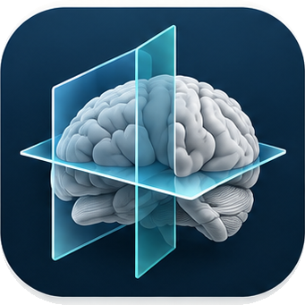

# Klinik Nöroanatomi Atlası

*Bu, [İngilizce README](../README.md) dosyasının Türkçesidir.*

Tarayıcıda çalışan üç boyutlu bir klinik nöroanatomi atlası: tek bir MNI koordinat çerçevesinde 585 mesh ve
eşzamanlı MR kesitleri, arter sulama alanları, izlenebilir yolaklar, bir sendromun neyi nasıl bozduğunu gösteren
lezyon kipi, klinik konular, bir sözlük ve vaka soruları — İngilizce ve Türkçe, her kayıt açık erişimli
kaynaklara atıflı. Statik dosyalardan çalışır; sunucu da hesap da gerektirmez.

**[Canlı demoyu açın →](https://aycibatuhan.github.io/nervous-system-atlas/)** — hiçbir kurulum gerekmez.

## Hızlı başlangıç

[Node.js](https://nodejs.org) 22 ya da üstü kuruluyken:

```bash
git clone https://github.com/aycibatuhan/nervous-system-atlas.git
cd nervous-system-atlas
npm start
```

İlk çalıştırma bağımlılıkları kurar ve atlas verisini indirir (49 MB), sonra uygulamayı
<http://localhost:5173> adresinde açar. Sonraki çalıştırmalarda `npm start` yalnızca başlatır.


## Neler yapar

- **Kesit ve üç boyut aynı çerçevede.** MR'a tıklayarak yapıyı seçin ya da bir yapıya tıklayarak kesitleri oraya taşıyın. Foramen magnumun altında kesitler bir spinal kord MR'ına devam eder.
- **Lezyon kipi.** Sendrom, sahneyi tuttuğu yapılara indirger, lezyon işaretini yerleştirir ve defisitleri taraf mantığıyla birlikte sırayla gösterir. **Yansıt** lezyonu diğer tarafa taşır.
- **Yolaklar ve kranial sinirler.** Nöron zincirleri, çaprazlaşmalar, çekirdekler, seyir, dallar, refleksler ve yatak başı testler; her durak tıklanabilir bir ara nokta.
- **Konular, sözlük ve vaka soruları.** Gelişimden komaya klinik konular, bir sözlük ve yanıtı ilgili yapıları üç boyutta öne çıkaran özgün vakalar.
- **Türkçe sürüm.** Arayüzün tamamı ve bütün klinik metinler, yapı adları Latince.
- **Yalnızca açık kaynaklar.** Her kayıt, herkesin ücretsiz okuyabileceği kaynaklara atıf verir; Hakkında paneli meshlerin geldiği her veri kümesini adlandırır.

> **Klinik kullanım için değildir.** Bu atlas eğitim amaçlı bir başvuru kaynağıdır. İçindeki yapılar grup ortalaması şablonlar ve kayıtlanmış bir örnektir, hiçbir hastanın kendi anatomisi değildir; klinik metinleri ise eksik, güncelliğini yitirmiş ya da yanlış olabilecek öğretim özetleridir. Buradaki hiçbir bilgi tıbbi tavsiye değildir; klinik kararlar, güncel kılavuzları ve hastanın kendi bulgularını kullanan yetkin hekimlere aittir.

## Belgeler

| Ne istiyorsanız… | Okuyun |
|---|---|
| atlası kullanmak — her özellik, klavye kısayolları, bir görünümü aynen kuran bağlantılar, içindekiler, sınırları | [Kullanım kılavuzu](guide.tr.md) · [English](guide.md) |
| bir kopyasını barındırmak, kendi MR'ınızı kesitlerde göstermek, veriyi yeniden üretmek, denetimleri koşturmak ya da kod üzerinde çalışmak | [Geliştirici kılavuzu](developing.md) (İngilizce) |
| bir değişiklik göndermek — dal kuralları, asla depoya girmemesi gerekenler, içerik ve çeviri kuralları | [Katkı](../CONTRIBUTING.md) (İngilizce) |
| her sürümde ne değiştiğini görmek | [Değişiklik günlüğü](../CHANGELOG.md) (İngilizce) |

## Lisans

Kod Apache-2.0 ([LICENSE](../LICENSE)); yazılmış içerik ve üretilen veri CC BY-SA 4.0
([content/LICENSE](../content/LICENSE)). Meshler ve hacimler, [NOTICE](../NOTICE) dosyasında ve uygulamanın
**Hakkında** panelinde adı geçen veri kümelerinin, her biri kendi lisansı altında, türevleridir. Atlasa ve
kaynaklarına nasıl atıf verileceği: [kullanım kılavuzu](guide.tr.md#lisanslar-ve-atıf).

## İletişim

Batuhan Ayci, <batuhanayci@gmail.com>. Katkılar beklenir; önce [CONTRIBUTING.md](../CONTRIBUTING.md) dosyasını
okuyun. Lisans, yeniden dağıtım ya da veri bütünlüğüyle ilgili endişeler için genel bir issue yerine
[SECURITY.md](../SECURITY.md) içindeki adrese yazın. Klinik olarak yanlış içerik ise sıradan bir issue
konusudur ve bildirilmesi memnuniyetle karşılanır.
